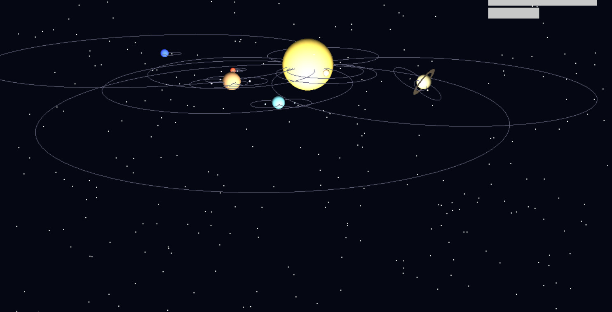

# CG_Project 🌌 3D Solar System Simulation - Modern Edition

This is a modern 3D solar system simulation built using **Python**, **Pygame**, and **PyOpenGL**. It visually represents the sun, planets, moons, and starfield in a dynamic and interactive OpenGL-rendered environment.

## 🚀 Features

- Realistic 3D rendering of the solar system using OpenGL
- Custom lighting and material properties
- Orbits for planets and moons
- Multiple moons for gas giants (e.g., Jupiter, Saturn)
- Saturn's rings rendered with a flat disk
- Starfield background
- Scalable and smooth animation
- Color palette inspired by a modern space theme

## 📸 Screenshot




> *Add a screenshot here of your simulation running*

## 🛠️ Technologies Used

- Python 3
- Pygame
- PyOpenGL
- OpenGL + GLU for 3D rendering

## 📦 Installation

### Prerequisites

Ensure Python 3 is installed. Then install the required libraries:

```bash
pip install pygame PyOpenGL PyOpenGL_accelerate
